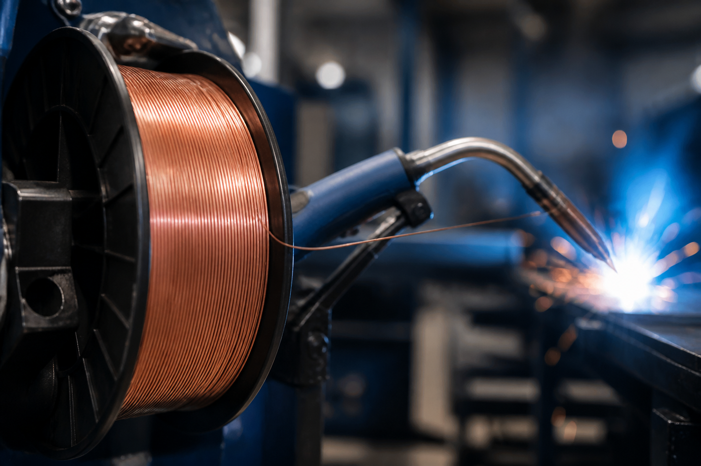
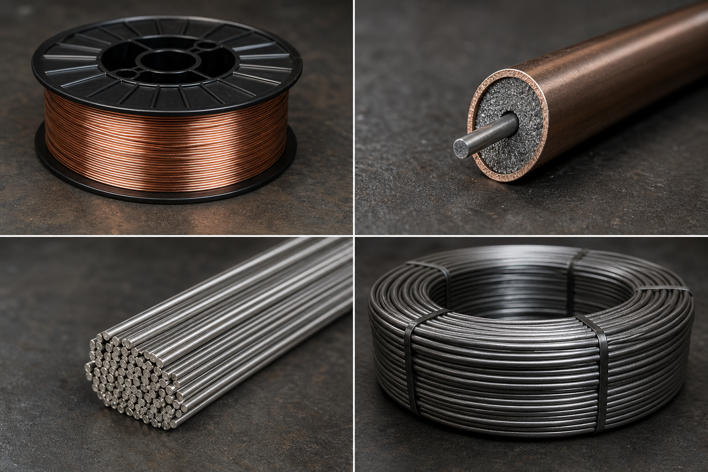
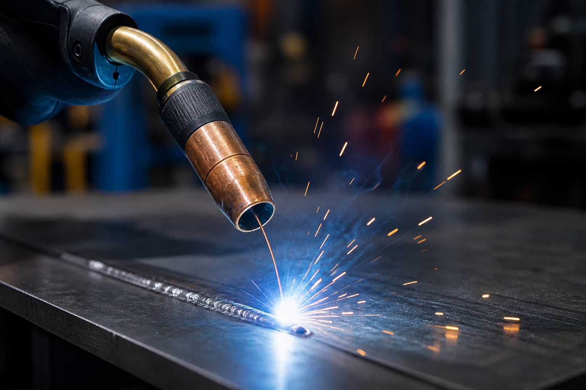
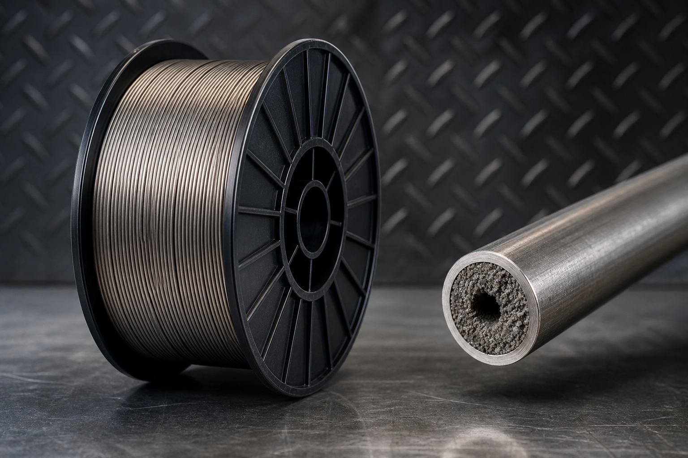
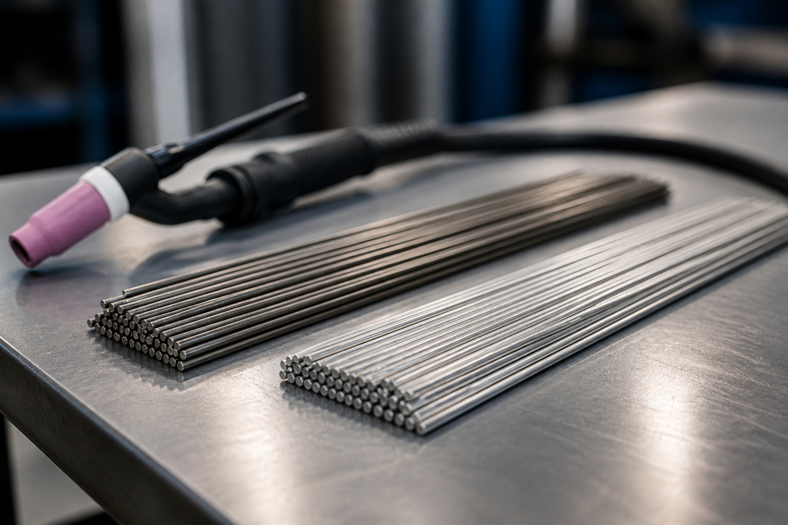

# راهنمای کامل انواع سیم جوش؛ کدام را بخریم؟

اگر در کارگاه یا خط تولید با جوشکاری سروکار دارید، انتخاب **سیم جوش** درست به‌اندازه تنظیم آمپر و گاز محافظ مهم است. در این مقاله، انواع رایج سیم جوش در بازار ایران را ساده و کاربردی مرور می‌کنیم تا برای پروژه بعدی‌تان انتخاب دقیق‌تری داشته باشید.

---

## سیم جوش چیست؟

سیم جوش فلز پرکننده‌ای است که در فرایندهای جوشکاری قوسی (مثل MIG/MAG، TIG و زیرپودری) ذوب می‌شود و اتصال بین قطعات را می‌سازد. کیفیت سیم روی این موارد اثر مستقیم دارد:

- پایداری قوس و میزان پاشش
- نفوذ و استحکام جوش
- ظاهر گرده جوش
- احتمال تخلخل، ترک و سرباره گیرکرده

---

## ۱) سیم جوش توپر CO2 / MIG-MAG (Solid Wire)

رایج‌ترین انتخاب کارگاه‌های ایران برای فولاد کربنی. معمولاً با کدهایی مثل **ER70S-6** عرضه می‌شود و با گاز CO2 یا مخلوط Ar/CO2 کار می‌کند.

**نقاط قوت**
- سرعت بالا و هزینه مناسب
- ظاهر جوش تمیز در تنظیم درست
- موجودی زیاد در بازار

**نقاط ضعف**
- به گاز محافظ وابسته است
- در باد و فضای باز حساس‌تر است
- کیفیت برندهای ضعیف باعث پاشش و گرفتگی نازل می‌شود

**کاربرد:** اسکلت فلزی، ساخت مخازن سبک، شاسی، ورق‌کاری، تولید سری.

---

## ۲) سیم جوش توپودری (Flux-Cored / FCAW)

سیم لوله‌ای با پودر داخل؛ بخشی از محافظت جوش را خود پودر تأمین می‌کند. مدل‌های با گاز و بدون گاز (self-shielded) دارد.

**نقاط قوت**
- نفوذ عمیق و رسوب‌گذاری بالا
- مناسب ضخامت‌های بیشتر و کار صنعتی
- بعضی مدل‌ها در فضای باز پایدارترند

**نقاط ضعف**
- دود و سرباره بیشتر
- قیمت معمولاً بالاتر از توپر
- تنظیم دستگاه حساس‌تر است

---

## ۳) مفتول / فیلر TIG

میله‌های صاف برای جوشکاری آرگون (TIG). برای کار ظریف، استیل، آلومینیوم و پاس ریشه بسیار رایج است.

**نقاط قوت**
- کنترل عالی و جوش تمیز
- مناسب ورق نازک و کار دقیق

**نقاط ضعف**
- سرعت کمتر نسبت به MIG
- نیاز به مهارت بالاتر جوشکار

---

## ۴) سیم جوش زیرپودری (SAW)

برای خطوط تولید سنگین، لوله و سازه ضخیم. همراه پودر مخصوص استفاده می‌شود.

**نقاط قوت:** رسوب بسیار بالا، جوش یکنواخت در کار پیوسته  
**نقاط ضعف:** تجهیزات بزرگ‌تر، مناسب کارگاه ثابت

---

## ۵) سیم‌های تخصصی (استیل، آلومینیوم، نیکل)

- **استیل:** سری‌هایی مثل ER308L / ER316L  
- **آلومینیوم:** ER4043 / ER5356 / ER5183  
- **نیکل و سوپرآلیاژ:** برای صنایع نفت، گاز و تعمیرات خاص

این‌ها را فقط از برند و بسته‌بندی معتبر بخرید؛ ناخالصی و اشتباه آلیاژ هزینه سنگینی دارد.

---

## جدول انتخاب سریع

| نیاز شما | پیشنهاد اولیه |
|---|---|
| فولاد معمولی کارگاهی | سیم توپر ER70S-6 + CO2 |
| ورق ضخیم / نرخ رسوب بالا | توپودری E71T |
| استیل ضدزنگ | ER308L یا ER316L |
| کار ظریف و پاس ریشه | فیلر TIG |
| خط تولید سنگین | زیرپودری SAW |

---

## نکته خرید در بازار ایران

1. قطر سیم را با ضخامت قطعه و توان دستگاه هماهنگ کنید (۰٫۸ / ۱٫۰ / ۱٫۲ میلی‌متر رایج‌ترین‌ها هستند).  
2. تاریخ تولید و سلامت قرقره/بسته‌بندی را چک کنید.  
3. برای پروژه حساس، برند دارای سرتیفیکت و آنالیز ترکیب شیمیایی بخواهید.  
4. سیم ارزانِ بدون اصالت معمولاً با پاشش، سوختگی و دوباره‌کاری گران تمام می‌شود.

در مقاله بعدی، برندهایی که در فروشگاه عرضه می‌شوند (ایساب، هیوندای، آما و…) را با سایر برندهای ایرانی و خارجی بازار ایران مقایسه کرده‌ایم.
