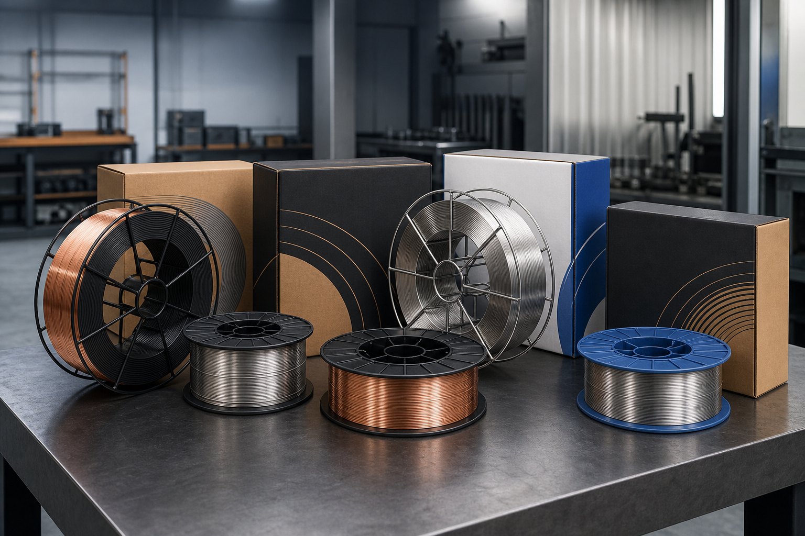

# مقایسه سیم جوش برندهای پیشرو جوش با برندهای ایرانی و خارجی بازار ایران

این مقاله مخصوص مخاطبان **[پیشرو جوش خاورمیانه](https://pishrojoosh.com/)** نوشته شده است؛ شرکتی که به‌عنوان نماینده رسمی **Voestalpine Böhler Welding** و **Lincoln Electric** در ایران فعالیت می‌کند و سبد گسترده‌ای از مواد مصرفی جوش (تیگ، میگ/مگ، توپودری، زیرپودری) و راهکارهای صنعتی ارائه می‌دهد.

در ادامه، برندهای اصلی قابل تأمین از پیشرو جوش را با سایر گزینه‌های رایج بازار ایران (ایرانی و وارداتی) مقایسه می‌کنیم تا برای پروژه‌های نفت و گاز، پتروشیمی، نیروگاه، فولاد، سیمان و کلدینگ تصمیم دقیق‌تری بگیرید.

> برای استعلام قیمت و موجودی: بخش [استعلام قیمت](https://pishrojoosh.com/#price-inquiry-section) در سایت پیشرو جوش.

---

## برندهای اصلی پیشرو جوش (مواد مصرفی / سیم جوش)

بر اساس برندهای معرفی‌شده در سایت:

| برند | نقش در سبد پیشرو جوش | تمرکز کاربردی |
|---|---|---|
| **Böhler Welding** | نماینده رسمی | فولاد، استیل، آلیاژهای خاص، پروژه‌های حساس |
| **Lincoln Electric** | نماینده رسمی | صنعتی عمومی تا سنگین، پایپ، اسکلت، تولید |
| **ESAB** | تأمین تخصصی | تنوع مصرفی و کدهای استاندارد جهانی |
| **Welding Alloys** | تخصصی | روکش‌کاری سخت / کلدینگ و نگهداری |
| **UTP Maintenance** | تخصصی | تعمیرات، نگهداری، روکش و آلیاژهای خاص |
| **KOBELCO / Haynes / Polymet** | تخصصی‌تر | کاربردهای آلیاژی و صنعتی خاص |
| **برندهای چینی منتخب** | پوشش اقتصادی‌تر | پروژه‌هایی با بودجه محدودتر (با غربالگری فنی) |

---

## ۱) برندهای پیشرو جوش؛ نقاط قوت و ضعف

### Böhler Welding (voestalpine) — اتریش/اروپا
**نقاط قوت**
- رهبر جهانی در consumableهای باکیفیت و آلیاژی  
- عالی برای استیل، سوپرآلیاژ، نیروگاه، نفت و گاز  
- یکنواختی بالا + مستندات فنی قوی  
- مناسب پروژه‌های دارای بازرسی، WPS و الزامات سخت

**نقاط ضعف**
- قیمت بالاتر از برندهای عمومی ایرانی  
- برای کارگاه ساختمانی ساده ممکن است «بیش از نیاز» باشد

**در برابر بازار ایران:** نسبت به آما/میکا کیفیت و تخصص بالاتر؛ نسبت به هیوندای/کیسول معمولاً سطح premiumتر برای کارهای حساس.

---

### Lincoln Electric — آمریکا
**نقاط قوت**
- اعتبار بسیار بالا در صنعت جهانی  
- عملکرد پایدار در MIG/MAG، توپودری و کاربردهای صنعتی  
- گزینه قوی برای تولید سری، اسکلت سنگین و پایپ

**نقاط ضعف**
- قیمت و حساسیت به نوسان ارز  
- اهمیت شدید اصالت کالا در بازار ایران (مسیر نمایندگی رسمی مزیت پیشرو جوش است)

**در برابر بازار:** رقیب مستقیم ایساب از نظر سطح؛ معمولاً بالاتر از برندهای عمومی داخلی از نظر یکنواختی و پشتیبانی فنی.

---

### ESAB
**نقاط قوت**
- سبد متنوع و شناخته‌شده در ایران  
- کدهای استاندارد زیاد (فولاد، استیل، آلومینیوم…)  
- مناسب وقتی کد خاصی از بوهلر/لینکلن موجود نیست یا جایگزین مهندسی لازم است

**نقاط ضعف**
- در بازار ایران گاهی کالای غیراصل دیده می‌شود؛ خرید از تأمین‌کننده معتبر حیاتی است  
- در بعضی سگمنت‌های فوق‌تخصصی، بوهلر یا Welding Alloys دقیق‌ترند

---

### Welding Alloys / UTP Maintenance
**نقاط قوت**
- تمرکز روی روکش سخت، کلدینگ، تعمیرات و نگهداری  
- هم‌راستا با خدمات کلدینگ پیشرو جوش  
- ارزش بالا وقتی عمر قطعه و مقاومت سایشی/خوردگی مهم است

**نقاط ضعف**
- عمومی نیستند؛ برای اسکلت معمولی انتخاب اول نیستند  
- نیاز به مشاوره فنی برای انتخاب آلیاژ درست

---

## ۲) برندهای ایرانی رایج در بازار (رقیب/جایگزین اقتصادی)

| برند | قوت | ضعف | چه زمانی انتخاب شود؟ |
|---|---|---|---|
| **آما** | ریشه‌دار، موجودی خوب، قیمت رقابتی‌تر | در کارهای فوق‌تخصصی کمتر از بوهلر/لینکلن مطرح است | مصرف عمومی، اسکلت، کارگاه |
| **میکا** | اقتصادی، در دسترس | یکنواختی و مستندات فنی معمولاً ضعیف‌تر برای پروژه حساس | بودجه محدود، کار غیرحساس |
| **یزد / پارس / زنجان و مشابه** | ارزان | کیفیت بچه‌متغیر، ریسک دوباره‌کاری | فقط کار غیرحساس و موقت |

**جمع‌بندی در برابر پیشرو جوش:** برندهای ایرانی برای هزینه کمتر خوب‌اند؛ اما برای نفت و گاز، نیروگاه، استیل حساس و کلدینگ، مسیر بوهلر / لینکلن / Welding Alloys معمولاً ریسک فنی کمتری دارد.

---

## ۳) سایر برندهای خارجی بازار ایران

### هیوندای (Hyundai)
- **قوت:** تعادل قیمت/کیفیت، موجودی نسبی در بازار  
- **ضعف:** عمق تخصصی بعضی کدهای آلیاژی کمتر از بوهلر  
- **رقابت با پیشرو جوش:** گزینه میانی بین برند داخلی و premium اروپایی/آمریکایی

### کیسول (Kiswel)
- **قوت:** قیمت منطقی‌تر از بعضی اروپایی‌ها  
- **ضعف:** شبکه/موجودی متغیر؛ اصالت مهم است  
- **رقابت:** نزدیک هیوندای از نظر سطح بازار

### برندهای متفرقه وارداتی/متفرقه
- ممکن است روی کاغذ ارزان باشند، ولی در پروژه واقعی با پاشش، آنالیز نامشخص و رد بازرسی گران تمام شوند.

---

## ۴) جدول مقایسه سریع (بازار ایران)

| معیار | Böhler | Lincoln | ESAB | Welding Alloys/UTP | آما | میکا/عمومی | هیوندای | کیسول |
|---|---|---|---|---|---|---|---|---|
| کیفیت یکنواخت | عالی | عالی | خیلی خوب | عالی در تخصص خود | خوب | متوسط تا خوب | خوب+ | خوب |
| مناسب پروژه حساس (نفت/گاز/نیروگاه) | عالی | عالی | خیلی خوب | عالی (روکش/تعمیر) | متوسط | ضعیف‌تر | خوب | خوب |
| قیمت تقریبی | بالا | بالا | بالا | بالا (تخصصی) | متوسط | پایین‌تر | متوسط+ | متوسط |
| موجودی تخصصی در ایران | قوی از مسیر نمایندگی | قوی از مسیر نمایندگی | خوب | تخصصی | خیلی خوب عمومی | خوب عمومی | خوب | متغیر |
| ریسک کالای غیراصل | کمتر با نمایندگی رسمی | کمتر با نمایندگی رسمی | متوسط در بازار آزاد | متوسط | کمتر | دارد | متوسط | متوسط |
| مناسب کار عمومی کارگاهی | بله (گاهی بیش‌ازنیاز) | بله | بله | خیر/کمتر | بله | بله | بله | بله |

---

## ۵) پیشنهاد انتخاب بر اساس سناریو (برای مشتری پیشرو جوش)

1. **نفت، گاز، پتروشیمی، نیروگاه با بازرسی:** Böhler یا Lincoln (و در صورت نیاز کد جایگزین ESAB معتبر)  
2. **کلدینگ / روکش سخت / افزایش عمر قطعه:** Welding Alloys + UTP + خدمات کلدینگ پیشرو جوش  
3. **تولید صنعتی و اسکلت سنگین با کیفیت پایدار:** Lincoln / ESAB / Böhler بر اساس WPS  
4. **کار عمومی و بودجه محدودتر:** آما یا هیوندای در بازار آزاد—با پذیرش تفاوت کیفیت نسبت به برندهای رسمی پیشرو جوش  
5. **آلومینیوم/استیل/آلیاژ خاص:** از سبد تخصصی پیشرو جوش (Böhler / Lincoln / ESAB / Haynes / Polymet / Kobelco) با مشاوره فنی

---

## چرا مسیر نمایندگی رسمی مهم است؟

در بازار ایران، بزرگ‌ترین ریسک فقط «قیمت قرقره» نیست؛ **اصالت، آنالیز شیمیایی، سرتیفیکت و یکنواختی بچه** است. مزیت پیشرو جوش در این است که:

- نماینده رسمی **Böhler** و **Lincoln** است  
- موجودی و مشاوره فنی برای صنایع سنگین دارد  
- کنار consumable، خدمات کلدینگ و NDT هم ارائه می‌کند

---

## جمع‌بندی

- اگر پروژه **حساس و تحت بازرسی** دارید: اولویت با برندهای سبد پیشرو جوش (به‌ویژه Böhler و Lincoln).  
- اگر فقط **ارزان‌ترین سیم عمومی** را می‌خواهید: برندهای ایرانی عمومی در بازار هست—ولی هزینه دوباره‌کاری را هم حساب کنید.  
- برای انتخاب دقیق کد سیم (تیگ / میگ / توپودری / زیرپودری)، از فرم [استعلام قیمت پیشرو جوش](https://pishrojoosh.com/#price-inquiry-section) استفاده کنید و مشخصات فلز پایه، ضخامت و فرایند جوش را بفرستید.
